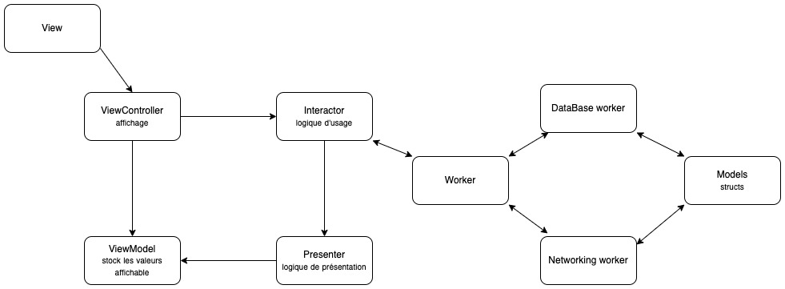

# EloraDelpierre_10_12122022
P10 Reciplease

# Reciplease

Reciplease is an application that allows you to search for recipes based on ingredients. It also allows you to save these recipes in favorites.
The application is organized in two parts, a search part and a favorites part.

As I'm in a work-study program, I chose to use the pods and the Clean Architecture customized by my CTO to practice their use.

## Pods 

   by Michael Coqueret

   by Michael Coqueret 

   by Michael Coqueret

  

## Custom Clean Archi 

The View Controller :

- Defines a scene and contains a view or views.
- Keeps instances of the interactor and view model.
- Passes the actions from views to the interactor (output)

The Interactor : 

- Contains the usage logic.
- Keeps a reference to the presenter.
- Runs actions on workers based on input (from the View Controller), triggers and passes the output to the presenter.

The worker : 

- An abstraction that handles different under-the-hood operations like fetch data from API, fetch and update from Core Data...

The Presenter : 

- Contains a display logic based on input (from the Interactor)
- fills the viewModel variables with data made displayable
- Keeps a reference to the view model.

The View Model : 

- Contains the data in their form directly displayable by the view controller
- Keeps reference to nobody

## Install

Use your own app id and app key in lines 25 and 26 of APIRequest

Install pods and run
